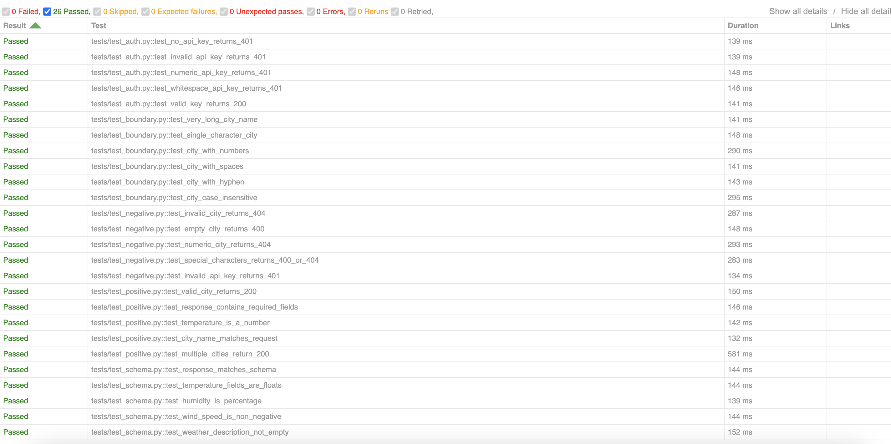

# API Test Automation Framework

[](https://github.com/nguwinv/api-test-automation-framework/actions/workflows/test.yml)

A pytest-based API test suite for the OpenWeather API, with CI/CD via GitHub Actions.

## Tech Stack
- Python, pytest, requests, Pydantic, pytest-html, GitHub Actions

## Test Coverage
| Suite | What it tests |
|---|---|
| test_positive.py | Valid cities, correct fields, status 200 |
| test_negative.py | Invalid cities, bad keys, missing params |
| test_boundary.py | Long names, special chars, case sensitivity |
| test_schema.py | Pydantic validation of response shape & types |
| test_auth.py | Empty, invalid, and whitespace API keys |

## Bugs This Would Catch
- API contract changes (fields renamed or removed)
- Auth regressions (valid keys suddenly rejected)
- Boundary edge cases (special characters breaking endpoints)
- Type changes (temp returning a string instead of float)

## How to Run
```bash
python3 -m venv venv
source venv/bin/activate
pip install -r requirements.txt
cp .env.example .env  # add your OpenWeather API key
pytest -v
```

## CI/CD
Tests run automatically on every push via GitHub Actions.

## Screenshots
### pytest-html Test Report

